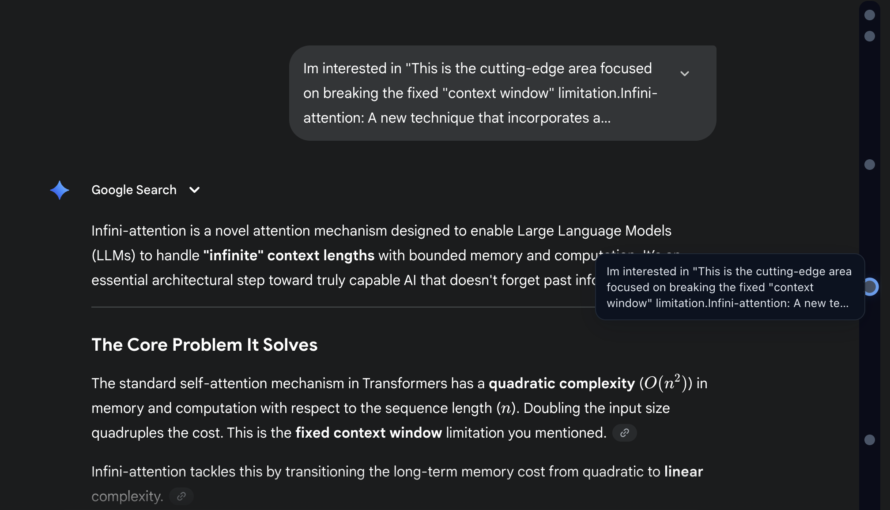

<div align="center">
  
  <h1>Gemini Voyager</h1>
  <h3>让 Gemini 体验更上一层楼 ✨</h3>
  <p>优雅的时间线导航、文件夹管理对话、保存常用提示词——这一个强大的扩展就够了</p>
  
  <p>
    
    
    
    
    
    
  </p>
</div>

<p align="center">
  <a href="../README.md">English</a>
</p>

---

## 功能特性

<div align="center">
  
</div>

### 📍 时间线导航

通过可视化节点导航对话：
- 点击节点跳转到对应消息
- 悬停预览消息内容
- 长按标记重要消息（跨标签页同步）
- 可拖拽时间线位置
- 自动跟随滚动位置

### 📂 文件夹管理

通过拖放操作管理对话：
- 两级层级结构（文件夹和子文件夹）
- 双击重命名，长按多选
- 自动识别 Gem 类型并显示图标
- 支持导入/导出，跨设备同步（[使用指南](./docs/IMPORT_EXPORT_GUIDE_ZH.md)）
- 在 Gemini 和 AI Studio 均可使用

<details>
<summary>查看截图</summary>

<table>
  <tr>
    <td align="center" width="50%">
      <p><b>Gemini</b></p>
      
    </td>
    <td align="center" width="50%">
      <p><b>AI Studio</b></p>
      
    </td>
  </tr>
</table>

</details>

### 💡 提示词库

保存和复用提示词：
- 基于标签的组织方式
- 关键词搜索
- 支持 JSON 导入/导出
- 在 Gemini 和 AI Studio 均可使用

<details>
<summary>查看截图</summary>

<div align="center">
  
</div>

</details>

### 📐 公式复制

点击 LaTeX/MathJax 公式复制源代码：
- 一键复制公式源码
- 支持行内和独立显示公式
- 复制成功视觉反馈

<details>
<summary>查看截图</summary>

<div align="center">
  
</div>

</details>

### 💾 对话导出（JSON + Markdown/PDF）

将对话导出为：
- 结构化 JSON
- Markdown/PDF（图片自动打包至 `assets/`，打印样式优化）
- 点击 Gemini 徽标旁的导出图标
- 保留星标消息
- 自动移除界面标签（如"显示思路"）

<details>
<summary>查看导出指南</summary>

<table>
  <tr>
    <td align="center" width="50%">
      <p><b>步骤 1：点击导出图标</b></p>
      
    </td>
    <td align="center" width="50%">
      <p><b>步骤 2：选择导出格式</b></p>
      
    </td>
  </tr>
</table>

</details>

<details>
<summary>导出格式示例</summary>

```json
{
  "format": "gemini-voyager.chat.v1",
  "url": "https://gemini.google.com/app/...",
  "exportedAt": "2025-01-01T12:34:56.000Z",
  "count": 3,
  "items": [
    { "user": "...", "assistant": "...", "starred": true }
  ]
}
```
</details>

### 📏 对话宽度调整

自定义对话区域宽度（400px - 1400px），支持实时预览。

> **设置面板**：点击扩展图标调整滚动模式、对话宽度和时间线选项。

<details>
<summary>查看教程</summary>

<table>
  <tr>
    <td align="center" width="50%">
      <p><b>如何打开设置</b></p>
      
    </td>
    <td align="center" width="50%">
      <p><b>对话宽度调整</b></p>
      
    </td>
  </tr>
</table>

</details>

---

## 📥 安装方式

> **⚠️ 推荐：** 从 [GitHub Releases](https://github.com/Nagi-ovo/gemini-voyager/releases) 下载最新版本  
> Chrome 应用商店的版本可能因审核延迟而不是最新的

### 方式一：手动安装（推荐）

**Chromium 浏览器（Chrome、Edge、Opera、Brave、Vivaldi、Arc）：**

1. 前往[项目 Releases 页面](https://github.com/Nagi-ovo/gemini-voyager/releases)，下载最新的 `gemini-voyager-chrome-vX.Y.Z.zip`
2. 解压到任意文件夹（可看到根目录下的 `manifest.json` 文件）
3. 打开浏览器的扩展管理页面并启用"开发者模式"：
   - Chrome：访问 `chrome://extensions`
   - Edge：访问 `edge://extensions`
   - Opera：访问 `opera://extensions`
4. 点击"加载已解压的扩展程序"
5. 选择刚才解压的文件夹

<details>
<summary>Firefox 安装方法</summary>

#### 1）临时安装（开发者模式）—— 简单且安全
1. 前往 [项目 Releases 页面](https://github.com/Nagi-ovo/gemini-voyager/releases)，下载 `gemini-voyager-firefox-vX.Y.Z.zip`
2. 解压文件
3. 在 Firefox 中打开 `about:debugging#/runtime/this-firefox`
4. 点击"临时载入附加组件..."
5. 选择解压文件夹中的 `manifest.json` 文件

> 提示：此方法为临时安装，重启 Firefox 后需重新载入。

#### 2）永久安装（适用于 Firefox ESR，可安装未签名插件）
如果你希望永久安装并使用发行版构建，可在 Firefox ESR（Extended Support Release）中允许安装未签名扩展：

1. 安装 [`firefox-esr`](https://www.mozilla.org/zh-CN/firefox/enterprise/)（ESR 版本通常提供以下配置选项）。
2. 地址栏输入 `about:config`，接受风险提示后继续。
3. 搜索 `xpinstall.signatures.required`，将其值设为 `false`。
4. 从 Releases 下载 `gemini-voyager-firefox-vX.Y.Z.xpi`。
5. 将 `.xpi` 文件拖入已打开的 Firefox ESR 窗口，或通过附加组件管理器安装该文件。

注意事项：
- 关闭签名校验会降低浏览器安全性，请仅在信任的构建下使用此方法。
- 该偏好项通常只在 Firefox ESR 可用；在新版标准 Firefox 中可能不可用。如果找不到该选项，请使用临时安装或等待官方签名发布。
- 安装完成后，根据需要决定是否保留 `xpinstall.signatures.required` 为 `false`，或在不再需要未签名扩展时切回 `true`。
</details>

<details>
<summary>Safari 安装方法</summary>

1. 从 [Releases](https://github.com/Nagi-ovo/gemini-voyager/releases) 下载 `gemini-voyager-safari-vX.Y.Z.zip`
2. 解压并转换：`xcrun safari-web-extension-converter dist_safari --macos-only --app-name "Gemini Voyager"`
3. 在 Xcode 中打开并运行（⌘R）
4. 在 Safari → 设置 → 扩展中启用

**系统要求：** macOS 11+、Xcode Command Line Tools（`xcode-select --install`）、Safari 14+

**注意：** 本地使用无需 Apple Developer 账号！详细说明请查看 [安装指南](../.github/docs/safari/INSTALLATION_ZH.md)。
</details>

### 方式二：Chrome 应用商店（更方便但可能不是最新版）

<div align="center">
  <a href="https://chromewebstore.google.com/detail/kjdpnimcnfinmilocccippmododhceol?utm_source=item-share-cb" target="_blank">
    
  </a>
</div>

最简单的安装方法，但可能没有最新功能：

1. 点击上方按钮访问 Chrome 应用商店
2. 点击"添加至 Chrome"
3. 扩展会自动在 Gemini 上激活

**适用于：** Chrome、Edge、Opera、Brave、Vivaldi、Arc 等所有 Chromium 浏览器

<details>
<summary>Edge 和 Opera 用户的安装说明</summary>

**Microsoft Edge 用户：**
1. 通过上方按钮访问 Chrome 应用商店
2. 浏览器会提示"允许来自其他商店的扩展"
3. 点击"允许"后即可正常安装

**Opera 用户：**
1. 先安装 [Install Chrome Extensions](https://addons.opera.com/extensions/details/install-chrome-extensions/)（Opera 官方扩展）
2. 然后访问 Chrome 应用商店
3. 像在 Chrome 上一样安装即可

**Brave、Vivaldi、Arc 等其他 Chromium 浏览器：**  
无需任何额外步骤，直接从 Chrome 应用商店安装即可！
</details>

---

## 🛠️ 开发者指南

<details>
<summary>点击查看开发环境配置方法</summary>

想要参与贡献或自定义扩展？以下是开发环境配置方法：

```bash
# 安装依赖（推荐使用 Bun）
bun i

# 开发模式（支持热重载）
bun run dev:chrome   # Chrome 和 Chromium 浏览器
bun run dev:firefox  # Firefox
bun run dev:safari   # Safari（需要 macOS）

# 生产构建
bun run build:chrome   # Chrome
bun run build:firefox  # Firefox
bun run build:safari   # Safari
bun run build:all      # 所有浏览器
```

或使用 npm/pnpm：
```bash
pnpm install
pnpm run dev:chrome    # Chrome
pnpm run dev:firefox   # Firefox
pnpm run dev:safari    # Safari（仅限 macOS）
```

### Safari 开发

Safari 需要额外的构建步骤。查看 [safari/README_ZH.md](../safari/README_ZH.md) 了解：
- 从源代码构建
- 开发工作流与自动重载
- 添加 Swift 原生代码
- 调试与发布

开发规范和最佳实践请参考 [CONTRIBUTING.md](./CONTRIBUTING.md)。
</details>

---

## 🌟 相关项目与致谢

- **[DeepSeek Voyager](https://github.com/Azurboy/deepseek-voyager)** - Gemini Voyager 的 Fork 版本，为 DeepSeek 适配，为 DeepSeek 用户带来时间线导航和对话管理功能！

- **[ChatGPT Conversation Timeline](https://github.com/Reborn14/chatgpt-conversation-timeline)** - 为 ChatGPT 设计的时间线导航扩展，本项目的灵感来源：Gemini Voyager 为 Gemini 适配了时间线概念，并添加了文件夹管理、提示词库、聊天导出等大量新功能。


## 🤝 参与贡献
[](https://deepwiki.com/Nagi-ovo/gemini-voyager )

欢迎参与贡献！无论是报告问题、提出功能建议、改进文档还是提交代码：

- **Issue**：使用我们的 [Bug 报告模板](https://github.com/Nagi-ovo/gemini-voyager/blob/main/.github/ISSUE_TEMPLATE/bug_report.md)或[功能请求模板](https://github.com/Nagi-ovo/gemini-voyager/blob/main/.github/ISSUE_TEMPLATE/feat_request.md)
- **Pull Request**：查看[贡献指南](./CONTRIBUTING.md)了解详细说明

感谢你帮助 Gemini Voyager 变得更好！❤️

---

## ☕ 支持本项目

如果你觉得 **Gemini Voyager** 对你有帮助，欢迎请我喝杯咖啡！你的支持能让这个项目持续发展。

<div align="center">
  <a href="https://www.buymeacoffee.com/Nag1ovo" target="_blank">
    
  </a>
</div>

<div align="center">
  <p><b>或通过微信/支付宝赞助：</b></p>
  <table>
    <tr>
      <td align="center">
        <br>
        <sub><b>微信支付</b></sub>
      </td>
      <td align="center">
        <br>
        <sub><b>支付宝</b></sub>
      </td>
    </tr>
  </table>
</div>

---

## Star History

<a href="https://www.star-history.com/#Nagi-ovo/gemini-voyager&type=date&legend=top-left">
 <picture>
   <source media="(prefers-color-scheme: dark)" srcset="https://api.star-history.com/svg?repos=Nagi-ovo/gemini-voyager&type=date&theme=dark&legend=top-left" />
   <source media="(prefers-color-scheme: light)" srcset="https://api.star-history.com/svg?repos=Nagi-ovo/gemini-voyager&type=date&legend=top-left" />
   
 </picture>
</a>

---

<div align="center">
  <p>用 ❤️ 为 Gemini 社区打造</p>
  <p>觉得有用的话，请给我们点个 ⭐ 吧！</p>
</div>

This project is licensed under the MIT License. Copyright © 2025 Jesse Zhang.