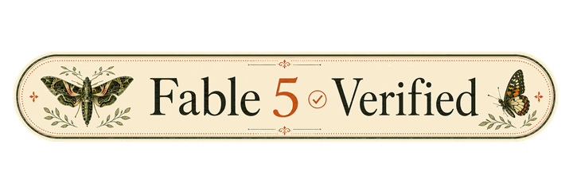
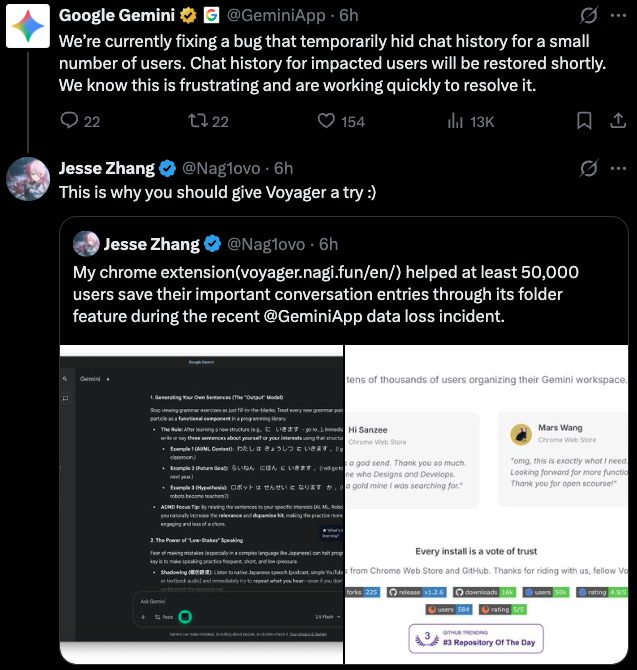
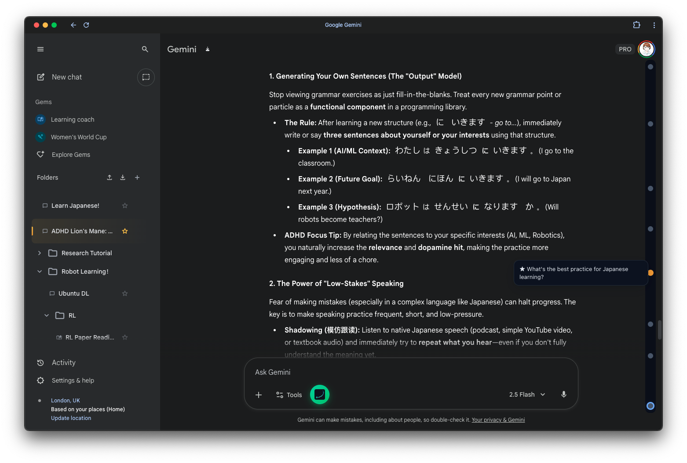

<div align="center">
  
  <h3>打造屬於你的 AI Chatbot 體驗 ✨</h3>
  <p>
    <b>Gemini · Claude · ChatGPT，終於完整了。</b>
  </p>
  
  <p>
    
    
    
    
    
    
  </p>
  <p>
    
    
    
    
    
    
    
    
    
  </p>
  <p>
    <a href="https://trendshift.io/repositories/16094" target="_blank"></a>
    <a href="https://www.producthunt.com/products/gemini-voyager?embed=true&amp;utm_source=badge-featured&amp;utm_medium=badge&amp;utm_campaign=badge-gemini-voyager" target="_blank" rel="noopener noreferrer"></a>
  </p>
  <p>
    <a href="https://x.com/Nag1ovo" target="_blank"></a>
    <a href="https://discord.gg/TEUFxdMbGb" target="_blank"></a>
    <a href="https://www.xiaohongshu.com/user/profile/5d366136000000001101950a" target="_blank"></a>
    <a href="https://space.bilibili.com/312249633" target="_blank"></a>
  </p>
</div>

<p align="center">
  <a href="https://voyager.nagi.fun/zh_TW">📖 文檔</a> • 
  <a href="../README.md">English</a> • 
  <a href="./README_ZH.md">简体中文</a> •
  <a href="./README_JA.md">日本語</a> •
  <a href="./README_FR.md">Français</a> •
  <a href="./README_ES.md">Español</a> •
  <a href="./README_PT.md">Português</a> •
  <a href="./README_RU.md">Русский</a> •
  <a href="./README_AR.md">العربية</a> •
  <a href="./README_KO.md">한국어</a>
</p>

<!-- Fable 5 Verified badge source: https://github.com/yetone/alma-releases/issues/56 (@yetone). -->
<p align="center">
  <a href="https://github.com/yetone/alma-releases/issues/56" target="_blank" rel="noopener noreferrer" title="Fable 5 Verified badge by @yetone" aria-label="Fable 5 Verified badge by @yetone">
    
  </a>
</p>

<!-- <p align="center">
    
  </p> -->

> [!NOTE]
> 如果 Voyager 有幫助，歡迎分享到 X、Facebook、YouTube、Threads、Dcard 等等。每一次分享都能讓更多人看見這個專案。謝謝。

---

## 👋 為什麼開發 Voyager？

我們熱愛 AI 聊天助手——Gemini、Claude、ChatGPT——但有時候總覺得它們少了一點"秩序感"。

這就是我們開發 **Voyager** 的初衷。它不僅僅是一個工具，更是一個能幫你把 AI 對話變得井井有條、觸手可及的得力助手。無論你是需要處理大量對話的研究人員，還是喜歡收藏代碼片段的開發者，亦或是單純的整理控，Voyager 都是為你準備的。

<p align="center">
  <a href="https://x.com/Nag1ovo/status/2024509398601597412?s=20" target="_blank">
    
  </a>
  <br>
  <i>在 2 月 18 號 Google Gemini App 導致部分用戶歷史對話無法訪問的問題中，Voyager 的用戶仍然能夠在其資料夾中看到被保存下來的對話。</i>
</p>

---

## ✨ 功能特性

<div align="center">
  
</div>

查看完整功能，請訪問我們的 [官方文檔](https://voyager.nagi.fun/zh_TW)。

### 🌌 通用核心 (Gemini & AI Studio)

- **📂 [資料夾管理](https://voyager.nagi.fun/zh_TW/guide/folders)**: 支持 **多級目錄**、**拖拽排序** 及 **Google Drive 同步**。
  - **Gemini**: 支持 **多帳號隔離模式** 及 **自定義資料夾顏色**。
- **💡 [提示詞庫](https://voyager.nagi.fun/zh_TW/guide/prompts)**: 跨平台同步提示詞，支持 Gemini、AI Studio 及 [自定義網站](https://voyager.nagi.fun/zh_TW/guide/custom-websites)。
- **☁️ [雲同步](https://voyager.nagi.fun/zh_TW/guide/cloud-sync)**: 支持將資料夾和提示詞庫同步到 Google Drive。
- **📐 公式複製**: 一鍵複製 LaTeX 和 MathML (Word) 源碼。
- **🌦️ 視覺特效**: 在設置面板中一鍵切換 **飄雪**、**電影感雨滴** 或 **櫻花飄落**，給頁面增添季節氛圍。

### ✨ Gemini 專屬增強

- **📍 [時間線導航](https://voyager.nagi.fun/zh_TW/guide/timeline)**: 可視化節點，瞬間跳轉訊息，星標重點，管理對話分支。
- **💾 [對話導出](https://voyager.nagi.fun/zh_TW/guide/export)**: 支持導出為 JSON、Markdown 或 PDF（含圖片）。
- **🧜‍♀️ [Mermaid 圖表渲染](https://voyager.nagi.fun/zh_TW/guide/mermaid)**: 自動渲染流程圖、時序圖等 Mermaid 圖表。
- **📝 [Markdown 渲染修復](https://voyager.nagi.fun/zh_TW/guide/markdown-fix)**: 自動修復 Gemini 注入 HTML 導致的 Markdown 加粗失效問題。
- **🍌 [Image Refinement](https://voyager.nagi.fun/zh_TW/guide/nanobanana)**: 自動去除 Gemini 生成圖片的無損浮水印。
- **🔬 [Deep Research](https://voyager.nagi.fun/zh_TW/guide/deep-research)**: 一鍵提取 Deep Research 對話的思考過程和研究鏈接。
- **🛠️ 效率工具**:
  - **[批量刪除](https://voyager.nagi.fun/zh_TW/guide/batch-delete)**: 批量清理對話記錄。
  - **[引用回覆](https://voyager.nagi.fun/zh_TW/guide/quote-reply)**: 選中對話文本即可一鍵引用回覆。
  - **[標籤頁標題同步](https://voyager.nagi.fun/zh_TW/guide/tab-title)**: 自動將標籤頁標題設為對話標題。
  - **[防自動跳轉](https://voyager.nagi.fun/zh_TW/guide/prevent-auto-scroll)**: 攔截每次發送新問題後頁面強制滾動到最底部的內建行為，找回絲滑體驗。
  - **[輸入框摺疊](https://voyager.nagi.fun/zh_TW/guide/input-collapse)**: 輸入框自動收納，釋放閱讀空間。
  - **[預設模型](https://voyager.nagi.fun/zh_TW/guide/default-model)**: 為新對話設置預設選中的模型。
  - **[隱藏最近項目和 Gem](https://voyager.nagi.fun/zh_TW/guide/recents-hider)**: 隱藏側邊欄的”最近”列表，減少干擾。

### 🔌 Claude & ChatGPT

- **📍 Claude 時間線**: 對話側邊欄，支持星標訊息和搜尋——同樣的導航體驗，現在也能在 Claude 上使用。
- **📊 Claude 用量條**: 直接在 Claude 介面中追蹤會話和每週用量。
- **📐 公式複製**: 一鍵複製 LaTeX 和 MathML 源碼（與 Gemini 共享）。
- **📏 舒適閱讀寬度**: 調整 Claude 和 ChatGPT 的對話寬度，獲得更好的閱讀體驗。
- **🔤 CJK 渲染修復**: 修復 Claude 上的中日韓字元渲染問題。

### 🎨 個性化體驗

- 點擊插件圖標，在設定中的 **視覺特效** 裡可切換 `關閉`、`飄雪`、`櫻花`、`雨`。
- 特效以輕量全螢幕覆蓋層呈現，不會阻擋頁面互動。
- 切換特效或關閉時，粒子會自然退場，不會突兀消失。

---

## 📥 安裝方式

> ⚠️ 注意：提示詞管理器是唯一支持 Gemini 企業版的功能。

<div align="center">
  <a href="https://chromewebstore.google.com/detail/iifacdnjakkhjjiengaffnegbndgingi?utm_source=github&utm_medium=readme&utm_campaign=organic_growth&utm_content=zh_tw" target="_blank">
    
  </a>
  &nbsp;&nbsp;
  <a href="https://microsoftedge.microsoft.com/addons/detail/voyager/gibmkggjijalcjinbdhcpklodjkhhlne" target="_blank"></a>
  &nbsp;&nbsp;
  <a href="https://addons.mozilla.org/firefox/addon/gemini-voyager/" target="_blank">
    
  </a>
  &nbsp;&nbsp;
  <a href="https://github.com/Nagi-ovo/voyager/releases/latest/" target="_blank">
    
  </a>
</div>

<p align="center">
  <sub><b>Edge 使用者：</b>考量到行動端和平板使用者需求，Voyager 會繼續維護並發布 Edge Add-ons 版本。若商店審核延遲，仍可暫時使用 Chrome 商店版或 GitHub 手動包。</sub>
</p>

> **商店狀態：** Chrome ✅ · Firefox ✅ · Safari ✅ · Edge ✅

關於 **手動安裝** 或 **開發構建**，請參閱 [安裝指南](https://voyager.nagi.fun/zh_TW/guide/installation)。

---

## ☕ 支持本項目

<div align="center">
  <a href="https://github.com/Nagi-ovo/voyager">
    
  </a>
</div>

如果 Voyager 提升了你的體驗，歡迎請我喝杯咖啡。贊助者將被列入致謝名單。❤️

<div align="center">
  <a href="https://www.buymeacoffee.com/Nag1ovo" target="_blank">
    
  </a>
  <a href="https://github.com/sponsors/Nagi-ovo" target="_blank">
    
  </a>
  
  <p><b>或通過微信 / 支付寶 / 愛發電支持：</b></p>
  <table align="center" border="0" cellpadding="0" cellspacing="0">
    <tr>
      <td align="center">
        <br>
        <sub><b>微信支付</b></sub>
      </td>
      <td align="center">
        <br>
        <sub><b>支付寶</b></sub>
      </td>
      <td align="center">
        <a href="https://afdian.com/a/nagi-ovo" target="_blank">
          <picture>
            <source media="(prefers-color-scheme: dark)" srcset="https://afdian-connect.deno.dev/profile.svg?slug=nagi-ovo&bg_color=%230d1117&text_color=%23dedbd7&border_color=%232e343d" />
            <source media="(prefers-color-scheme: light)" srcset="https://afdian-connect.deno.dev/profile.svg?slug=nagi-ovo" />
            
          </picture>
        </a><br>
        <sub><b>愛發電</b></sub>
      </td>
    </tr>
  </table>
</div>

### 🎙️ 特別推薦: Typeless

我非常推薦 **[Typeless (typeless.com)](https://www.typeless.com/?via=gemini-voyager)**，一款 AI 語音轉文字工具。我在開發過程中一直在使用它，極大地提升了我的工作效率。

> 🎁 **[點擊我的邀請鏈接](https://www.typeless.com/?via=gemini-voyager)**（邀請碼 _`gemini-voyager`_）可獲得 **5 美元免費額度**。這也是支持本項目的一種免費方式！❤️

---

## 💬 交流與回饋

<table>
  <tr>
    <td align="center" width="50%" valign="top">
      <a href="https://x.com/Nag1ovo/status/2012609459663634589" target="_blank">
        
      </a>
      <br><br>
      <b>關注動態</b><br>
      <sub>獲取最新動態。</sub>
    </td>
    <td align="center" width="50%" valign="top">
      <a href="https://discord.gg/TEUFxdMbGb" target="_blank">
        
      </a>
      <br><br>
      <b>加入社區</b><br>
      <sub>與其他用戶交流、分享提示詞、獲取幫助。</sub>
    </td>
  </tr>
</table>

---

## 🤝 參與貢獻與開發

[](https://deepwiki.com/Nagi-ovo/voyager)

歡迎參與貢獻！

- **Issue**：使用 [Bug 報告](https://github.com/Nagi-ovo/voyager/issues/new?template=bug_report.yml) 或 [功能請求](https://github.com/Nagi-ovo/voyager/issues/new?template=feature_request.yml) 模板。
- **Pull Request**：請查看 [貢獻指南](./CONTRIBUTING.md)。

<details>
<summary>開發環境配置</summary>

```bash
# 安裝依賴 (推薦 Bun)
bun i

# 開發模式
bun run dev:chrome
bun run dev:firefox
bun run dev:safari

# 生產構建
bun run build:chrome
bun run build:edge     # Edge 獨立打包
bun run build:firefox
bun run build:safari
bun run build:all      # Chrome + Firefox + Safari
```

**Safari 開發**：執行 `bun run build:safari`，然後開啟 `Voyager/` 中已納入版本控制的 Xcode 專案。

</details>

感謝你讓 Voyager 變得更好！❤️

### ❤️ 特別感謝

特別感謝所有為 Voyager 做出貢獻的貢獻者們 ❤️

<a href="https://github.com/Nagi-ovo/voyager/graphs/contributors">
  
</a>

---

## 🌟 致謝

> Voyager 只是一個小小的 side project。比起做那些把其他擴充功能使用者遷移過來的入口，我更想把時間花在真正幫到人的事情上。

- **[ChatGPT Conversation Timeline](https://github.com/Reborn14/chatgpt-conversation-timeline)** - 本項目的靈感來源。

- **[gemini-watermark-remover](https://github.com/journey-ad/gemini-watermark-remover) / [GeminiWatermarkTool](https://github.com/allenk/GeminiWatermarkTool)** - Image Refinement 基於這些專案適配而來，相關第三方 MIT 聲明保留在 [THIRD_PARTY_NOTICES.md](../THIRD_PARTY_NOTICES.md)。

- **[Gemini Helper](https://github.com/urzeye/tampermonkey-scripts)** - 預設模型鎖定功能中的部分互動邏輯參考自 Gemini Helper，並已在原始碼中保留 attribution。

## 🌍 生態

受 Voyager 啟發的項目：

如果你的項目受到 Voyager 啟發、直接 fork 自 Voyager，或基於 Voyager 改造而來，歡迎提交 PR 加入這裡。

- **[DeepSeek Voyager](https://github.com/Azurboy/deepseek-voyager)** - 為 DeepSeek 適配的 Fork 版本。

- **[claude-nexus](https://github.com/Qiuner/claude-nexus)** - 受 Voyager 啟發的 Claude.ai 增強擴充套件，提供時間軸導覽、資料夾管理、提示詞庫等功能，並與 Voyager 的提示詞匯入/匯出完全相容！

- **[Better_Doubao](https://github.com/Rex16200513/Better_Doubao)** - 為豆包提供增強導航、組織管理和生產力功能的瀏覽器擴充功能。

---

## 📄 授權

Voyager 基於 **GPL-3.0** 授權發布。
Image Refinement 相關程式碼與資源的第三方 MIT 聲明保留在 [THIRD_PARTY_NOTICES.md](../THIRD_PARTY_NOTICES.md)。

Gemini 是 Google LLC 的商標。Claude 是 Anthropic, PBC 的商標。ChatGPT 是 OpenAI, Inc. 的商標。Voyager 是獨立專案，與上述公司無隸屬、背書或贊助關係。

---

<div align="center">
  <a href="https://www.star-history.com/#Nagi-ovo/voyager&type=date&legend=top-left">
   <picture>
     <source media="(prefers-color-scheme: dark)" srcset="https://api.star-history.com/svg?repos=Nagi-ovo/voyager&type=date&theme=dark&legend=top-left" />
     <source media="(prefers-color-scheme: light)" srcset="https://api.star-history.com/svg?repos=Nagi-ovo/voyager&type=date&legend=top-left" />
     
   </picture>
  </a>
  <p>Made with ❤️ by Jesse Zhang</p>
  <sub>GPLv3 License © 2026</sub>
</div>
