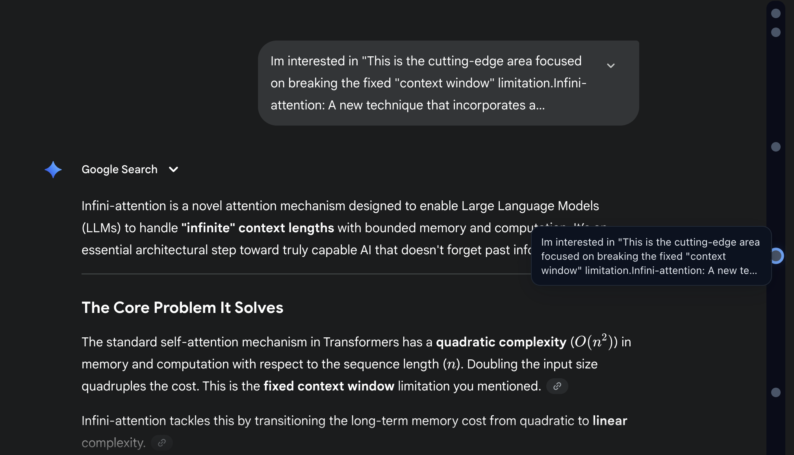

<div align="center">
  
  <h1>Gemini Voyager</h1>
  <h3>Supercharge Your Gemini Experience ✨</h3>
  <p>Navigate conversations with an elegant timeline, organize chats with folders, and save your favorite prompts—all in one powerful extension.</p>
</div>

<p align="center">
  <a href="./.github/README_ZH.md">中文说明</a>
</p>

---

## 🚀 Quick Install

<div align="center">
  <a href="https://chromewebstore.google.com/detail/kjdpnimcnfinmilocccippmododhceol?utm_source=item-share-cb" target="_blank">
    
  </a>

  <p><b>Works on all Chromium browsers: Chrome, Edge, Opera, Brave, Vivaldi, Arc, and more</b></p>

  <details>
  <summary><i>Using Edge or Opera? Click here for installation tips</i></summary>
  <br>
  <p align="left">
    <b>For Microsoft Edge users:</b><br>
    1. Click the install button above to visit Chrome Web Store<br>
    2. You'll see a prompt "Allow extensions from other stores"<br>
    3. Click "Allow" and then install normally<br>
    <br>
    <b>For Opera users:</b><br>
    1. First install <a href="https://addons.opera.com/extensions/details/install-chrome-extensions/">Install Chrome Extensions</a> (official Opera extension)<br>
    2. Then click the install button above<br>
    3. Install like you would on Chrome<br>
    <br>
    <b>For Brave, Vivaldi, Arc, and other Chromium browsers:</b><br>
    Just click the install button above—it works right out of the box! No extra steps needed.
  </p>
  </details>

  <p><i>Firefox version coming soon!</i></p>
</div>

---

## ✨ What Can It Do?

**Gemini Voyager** enhances your Gemini chat experience with four powerful features:

<div align="center">
  
</div>

### 📍 Interactive Timeline

Navigate your conversations like never before:
- **Visual Navigation**: See all your messages as clickable nodes on a timeline
- **Quick Preview**: Hover over any node to preview your message
- **Star Important Messages**: Long-press to mark key moments—stars sync across all your tabs
- **Always in Sync**: Scroll freely; the timeline stays perfectly aligned with your chat

### 📂 Folder Manager

Keep your conversations organized:
- **Drag & Drop**: Simply drag conversations from the sidebar into folders
- **Two-Level Organization**: Create folders and subfolders for better structure
- **Smart Icons**: Automatically shows unique icons for different Gem types (Learning Coach, Coding Partner, Writing Editor, and more)
- **Smooth Navigation**: Switch between conversations instantly—no page reloads
- **Persistent Storage**: Your folder structure is saved locally in your browser and shared across all your Gemini accounts (u/0, u/1, etc.)

### 💡 Prompt Manager

Build your personal prompt library:
- **Save & Reuse**: Store your favorite prompts with custom tags
- **Instant Search**: Find prompts quickly with keyword search
- **One-Click Copy**: Reuse prompts with a single click
- **Import/Export**: Share your prompt library as JSON files
- **Works Everywhere**: Available on both Gemini and AI Studio

### 💾 Export Chat History

Download your conversations for safekeeping:
- **One-Click Export**: Click the export icon next to the Gemini logo
- **Clean JSON Format**: Get your chats in a structured, readable format
- **Includes Stars**: Your starred messages are preserved in the export
- **No Clutter**: Automatically removes UI labels like "Show thinking" for cleaner data

Example payload shape:

```json
{
  "format": "gemini-voyager.chat.v1",
  "url": "https://gemini.google.com/app/...",
  "exportedAt": "2025-01-01T12:34:56.000Z",
  "count": 3,
  "items": [
    { "user": "...", "assistant": "...", "starred": true }
  ]
}
```

---

## 📥 Installation Options

### Option 1: Chrome Web Store (Recommended)

The easiest way to get started:

1. **Visit the Chrome Web Store**: [Install Gemini Voyager](https://chromewebstore.google.com/detail/kjdpnimcnfinmilocccippmododhceol?utm_source=item-share-cb)
2. **Click "Add to Chrome"**
3. **You're all set!** The extension will activate automatically on Gemini

**Works on:** Chrome, Edge, Opera, and other Chromium-based browsers

### Option 2: Manual Installation (Advanced)

For developers or users who prefer manual installation:

#### Load your extension (Chromium: Chrome / Edge / Opera)

1. Go to the [repository Releases page](https://github.com/Nagi-ovo/gemini-voyager/releases) and download the latest archive named like `gemini-voyager-chrome-vX.Y.Z.zip`.
2. Unzip it to a folder (you will see `manifest.json` at the root).
3. Open your extensions page and enable Developer mode:
   - Chrome: `chrome://extensions`
   - Edge: `edge://extensions`
   - Opera: `opera://extensions`
4. Click “Load unpacked”.
5. Select the unzipped folder (e.g. `Gemini Voyager vX.Y.Z`).

#### Load your extension (Firefox)

1. Go to the [repository Releases page](https://github.com/Nagi-ovo/gemini-voyager/releases) and download `gemini-voyager-firefox-vX.Y.Z.zip`
2. Unzip it
3. Open `about:debugging#/runtime/this-firefox` in Firefox
4. Click "Load Temporary Add-on…"
5. Select the `manifest.json` inside the unzipped folder

---

## 🛠️ For Developers

Want to contribute or customize the extension? Here's how to set up the development environment:

```bash
# Install dependencies (Bun recommended)
bun i

# Chrome development mode
bun run dev:chrome

# Firefox development mode
bun run dev:firefox
```

Or with pnpm:
```bash
pnpm install
pnpm run dev:chrome  # Chrome
pnpm run dev:firefox # Firefox
```

For contribution guidelines and best practices, see [CONTRIBUTING.md](./.github/CONTRIBUTING.md).

---

## 🙏 Credits

Inspired by [ChatGPT Conversation Timeline](https://github.com/Reborn14/chatgpt-conversation-timeline). We adapted the timeline concept for Gemini and added extensive new features including folder management, prompt library, and chat export.


## 🤝 Contributing

We welcome contributions from everyone! Whether you want to:
- 🐛 Report a bug
- 💡 Suggest a new feature
- 📝 Improve documentation
- 🔧 Submit code improvements

**Getting Started:**
- **Bug Reports**: Use our [bug report template](https://github.com/Nagi-ovo/gemini-voyager/blob/main/.github/ISSUE_TEMPLATE/bug_report.md)
- **Feature Requests**: Use our [feature request template](https://github.com/Nagi-ovo/gemini-voyager/blob/main/.github/ISSUE_TEMPLATE/feat_request.md)
- **Pull Requests**: Check out [CONTRIBUTING.md](./.github/CONTRIBUTING.md) for guidelines

Thank you for helping make **Gemini Voyager** better! ❤️

---

<div align="center">
  <p>Made with ❤️ for the Gemini community</p>
  <p>If you find this useful, consider giving us a ⭐ on GitHub!</p>
</div>